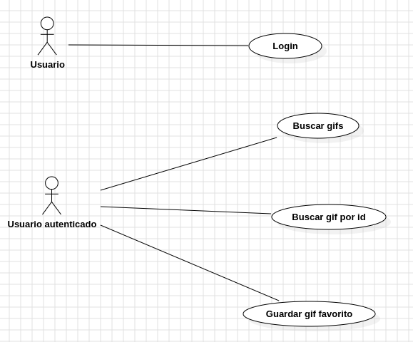
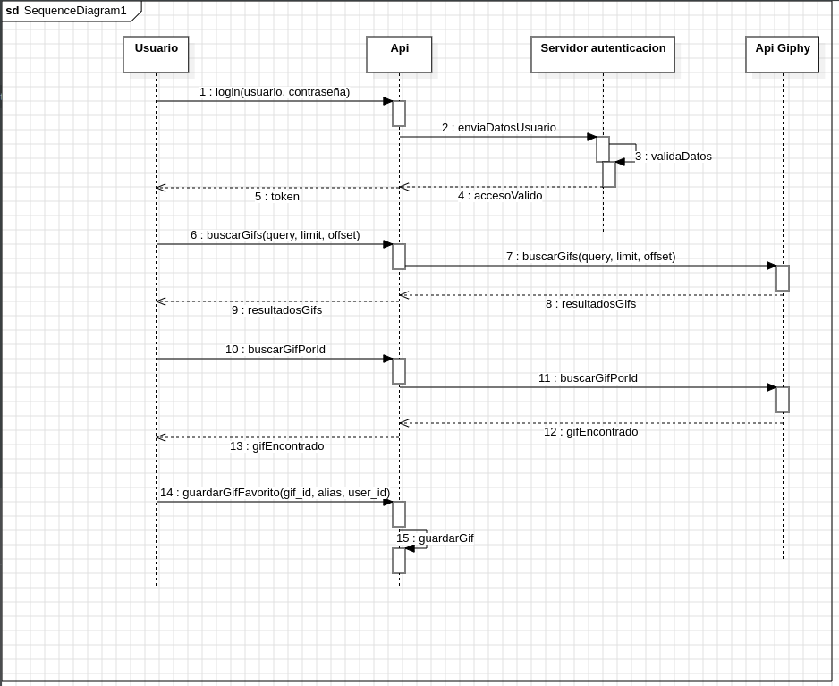
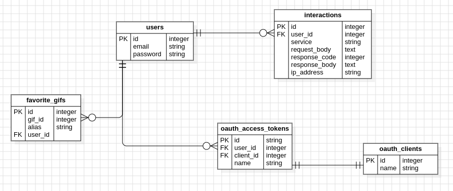

## Levantar proyecto

- cd *carpeta-proyecto*
- cp .env.example .env
- docker compose up
- Ingresar a contenedor de Docker: <strong>docker exec -it laravel_app bash</strong>
- Instalar dependencias: <strong>composer install</strong>
- Generar key de aplicación: <strong>php artisan key:generate</strong>
- Correr migraciones y seeder: <strong>php artisan migrate && php artisan db:seed</strong>
- Instalar passport: <strong>php artisan passport:install</strong>
- Usuarios creados: 
    - email: test1@test.com.ar password: password
    - email: test2@test.com.ar password: password
    - email: test3@test.com.ar password: password
- Asegurarse que este seteada la variable GIPHY_API_KEY=ysKpttUjoKfPdhEpx77RLeQFCuYrp1TN en el .env o cambiar a KEY de Giphy.

## Diagrama de casos de uso

1. Login
   - Actores: Usuario
   - Precondiciones: 
     - El usuario debe estar registrado.
     - El email y la contraseña deben ser válidos.
   - Escenario principal:
     - El usuario ingresa su email y contraseña.
     - El sistema valida las credenciales.
     - Si las mismas son correctas, se genera un token con una expiración de 30 minutos.
     - Se devuelve el token al usuario para futuras solicitudes que requieren autenticación.
   - Resultado esperado: El usuario recibe un token válido.
   - Postcondiciones: 
     - El usuario está autenticado y puede acceder a otros endpoints que requieren autenticación.
     - El sistema registra la interacción en la base de datos con los siguientes datos: user_id, service, request_body, response_code, response_body, ip_address.     

2. Buscar gifs
    - Actores: Usuario autenticado
    - Precondiciones:
      - El usuario debe estar autenticado con un token válido.
      - El usuario envía en la petición el parámetro requerido 'query'.
    - Escenario principal:
      - El usuario envía en la petición el parámetro requerido 'query' y los parámetros opcionales 'limit' y 'offset'.
      - El sistema envía la consulta a la API de Giphy
      - La API de Giphy devuelve una lista de GIFs coincidentes con la consulta.
      - El sistema devuelve esta lista al usuario.
    - Resultado esperado: Lista de GIFs.
    - Postcondiciones: El sistema registra la interacción en la base de datos con los siguientes datos: user_id, service, request_body, response_code, response_body, ip_address.

3. Buscar GIF por id
    - Actores: Usuario autenticado
    - Precondiciones:
      - El usuario debe estar autenticado con un token válido.
      - El usuario envía un ID de GIF válido.
    - Escenario principal:
      - El usuario ingresa un id de GIF.
      - El sistema envía la solicitud a la API de Giphy con el id proporcionado.
      - La API de Giphy devuelve la información del GIF correspondiente al id.
      - El sistema retorna la información del GIF al usuario.
    - Resultado esperado: El usuario recibe la información del GIF específico.
    - Postcondiciones: El sistema registra la interacción en la base de datos con los siguientes datos: user_id, service, request_body, response_code, response_body, ip_address.

4. Guardar GIF favorito
    - Actores: Usuario autenticado
    - Precondiciones:
        - El usuario debe estar autenticado con un token válido.
        - El usuario envía en el cuerpo de la petición el gif_id, alias y user_id.
    - Escenario principal:
        - El usuario ingresa un gif_id, un alias y su user_id.
        - El sistema envía la solicitud a la API de Giphy con el id proporcionado.
        - El sistema guarda el GIF como favorito del usuario, asociando el gif_id y el alias con el user_id.
        - El sistema confirma que el GIF ha sido guardado como favorito.
    - Resultado esperado: El GIF es guardado exitosamente como favorito del usuario.
    - Postcondiciones: El sistema registra la interacción en la base de datos con los siguientes datos: user_id, service, request_body, response_code, response_body, ip_address.

## Diagrama de secuencia

## Diagrama de Datos

## Colección postman

Abrir Postman e importar archivo <strong>postman_collection.json</strong> ubicado en la raíz de este proyecto.
